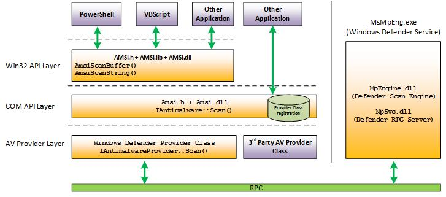

# Introduction
- Anti-malware Scan Interface is a windows feature that provides a standard interface between the OS and the installed anti-malware vendor.
- AMSI is designed to integrate applications with the most common malware scanning and protection.
- AMSI works by applying signature based detections, wherein it leverages an extensive database of signatures corresponding to specific malicious keywords, URLs, functions and procedures. 

# AMSI Architecture
- AMSI operates independently of hte installed anti-malware vendors for its signature database.
- Interacting with AMSI can be done in 2 ways:
1. Using AMSI WinAPIs
2. Using AMSI COM Interfaces (COM interfaces calling AMSI WinAPIs)

- AmsiOpenSession     - Initiates a session with AMSI to enable subsequent scanning and analysis of content for potential malware threats.
- AmsiScanBuffer      - Used to scan a provided buffer of data for potential malware, providing detection and analysis capabilities.
- AmsiScanString      - Enables the scanning and analysis of a specified string for potential malware threats.
